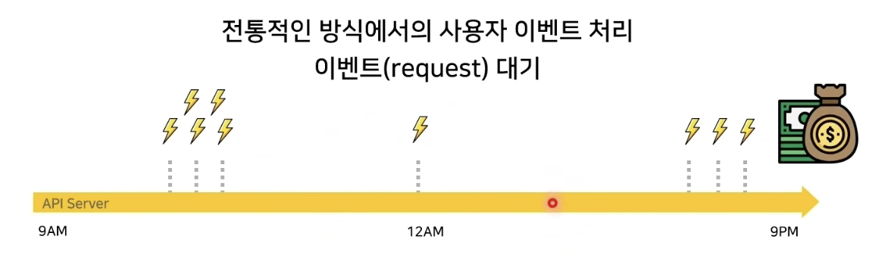
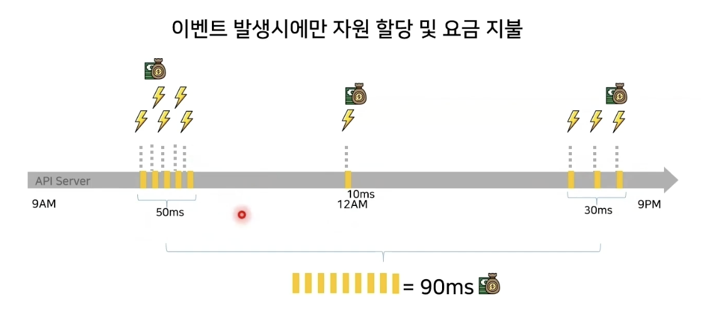
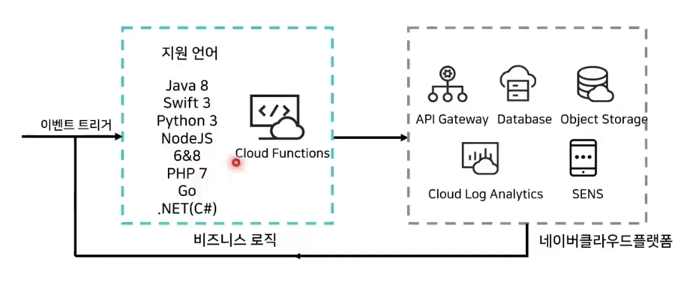
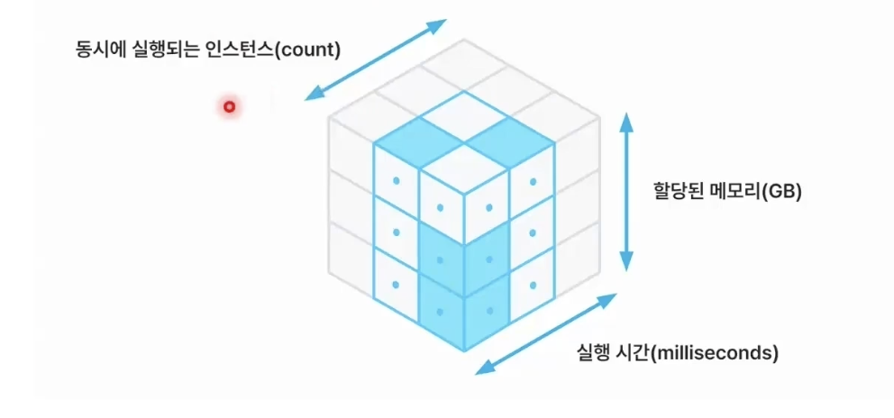
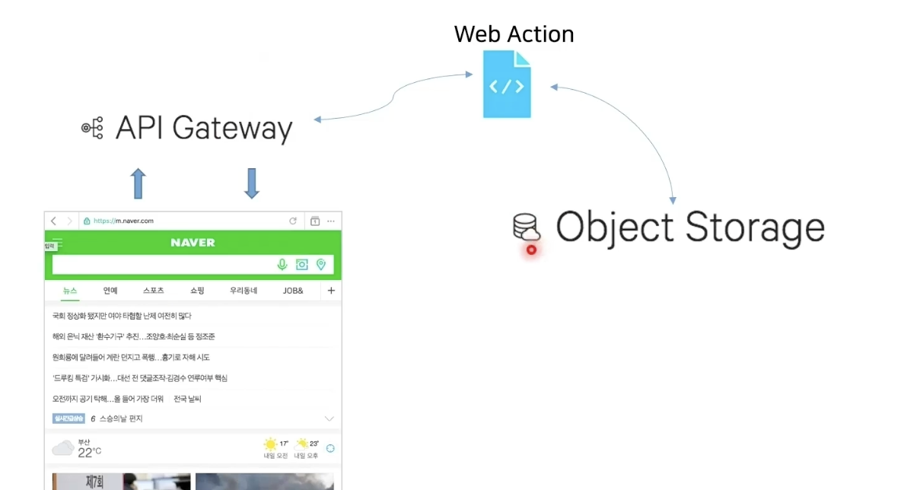
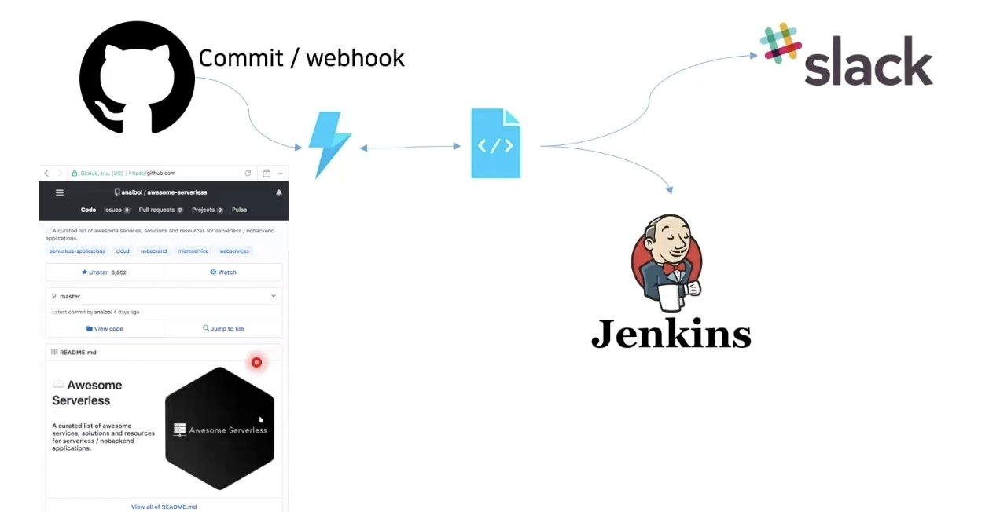
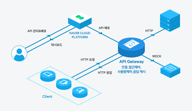

## Cloud Functions로 서버리스 간단히 구현하기

## Contents
서버리스 컴퓨팅이란?
Cloud Functions 소개
API Gateway 소개
Demo

### 서버리스 컴퓨팅이란?

전통적인 방식
    

서버리스 방식
- 이벤트 발생시에만 자원 할당 및 요금 지불
    

### Cloud Functions 소개
- 실행된 만큼만 과금이 되고 효율적으로 운영될 수 있는 서비스
- 이벤트에 기반한 액션을 수행하는 서버리스 서비스
- 사용자의 인프라 관리 부담없이 원하는 로직을 분산된 클라우드 환경에서 동작하고 결과를 반환
- 네이버 클라우드 플랫폼의 서비스를 Trigger 하여 다양한 형태의 서버리스 환경을 구축 가능
- 현재 연동 가능한 서비스 : API Gateway, Database, Object Storage, Cloud Log Analytics, SENS

    

#### Cloud Functions 구성 요소

- **액션**
    - REST API, 관련 하나의 특정 작업을 수행하는 상태가 없는 코드 조각
    - JavaScript, Swift, Java, Phthon, PHP 등 원하는 언어로 작성
    - 액션 소스 코드의 최대 크기 제한 : 48MB

- **트리거**
    - 연동 가능한 클라우드 서비스나 외부 서비스에서 이벤트를 받아와 "액션"을 실행할 수 있는 이벤트 전달 객체
    - 이벤트가 발생할 경우 해당 이벤트에 따라 1개 이상의 액션을 병렬로 실행
    - ex) Object Storage에 이미지 파일이 업로드되는 이벤트를 알림을 발견했을 때 액션을 실행하는 형태로 구현할 수 있음

- **웹 액션**
    - 웹 기반 응용 프로그램을 만드는데 사용
    - 웹 응용 프로그램이 인증 키 없이 익명으로 액세스 하는 밷엔드 로직을 구현 가능
    - 인증 및 OAuth와 같은 기능이 필요한 경우, 액션 내에서 직접 구현하여 사용

- **패키지**
    - 액션과 피드를 공유하는 단위
    - 연관된 액션들과 피드들을 하나의 단위로 관리할 수 있고, 다른 사용자와 공유 가능
    - Cloud Functions 에서는 미리 유용한 공유 패키지들을 제공

#### Cloud Functions 특징

- **서버 관리 부담에서 탈피**
    - 서버를 프로비저닝 하거나 관리할 필요가 없음
    - 코드를 작성하고 액션으로 등록함으로써 손쉽게 코드를 Cloud Functions에서 실행할 수 있음

- **On-demand Execution**
    - 서버를 확장하는 데 신경 쓸 필요가 없음
    항상 요청과 동일한 회수의 코드 실행이 보장되며, 요청이 없을 경우 코드가 실행되지 않기에 비용이 절감

- **개발 속도 향상**
    - 서버에 배포하거나 구동하는 작업을 할 필요 없이 오직 비즈니스 로직의 개발에만 집중할 수 있기 때문에 개발 속도가 향상됨
    - 액션의 코드를 수정하면, 그 즉시 수정된 코드가 반영되어 실행됨

- **다양한 작동 방식**
    - Cloud Functions과 연동하여 다양한 서비스 구축이 가능
    - 서버 없는 백엔드를 구축하여 웹, 모바일, IoT 등 다양한 API 요청을 처리가 가능하며 향후, 다양한 네이버 클라우드 플랫폼 서비스와 연동 예정

#### Cloud Functions 요금 및 동작 구조
    

- 요청 : 총 요청 수에 대해 요금이 부과
- 소요 시간 : 소요 시간은 코드가 실행을 시작한 시간부터 반환되거나 종료될 때까지 계산되며 최대 100ms 단위로 올림된다. 요금은 함수에 할당한 메모리 양에 따라 다르다.(기기바이트 메모리 단위로 초당 비용이 청구)
- 얼마나 요청이 들어왔는지, 얼마만큼의 리소스를 사용했는지, 얼마나 오랫동안 리소스를 사용했는지에 따라 요금으로 계산된다.
- 일정 용량을 넘어야 요금을 받음

    
- 트리거는 어떤 이벤트가 발생하는 것을 의미 (Object Storage 에 무언가가 업로드 됐을때, cron jobs가 실행됐을 때 실행)
- 액션에는 코드가 들어가기 때문에 코드 혹은 Function이라고 부름
- Package는 액션들을 그룹핑해놓은 것

#### Cloud Functions 사례
- 간단한 웹 서비스 운영 한다고 했을 때
    - 정적 웹 소스(JavaScript)를 Object Storage에 저장
    - 실행하는 코드를 Web Action으로 작성
    - API GateWay를 연동해서 운영
    - 웹 서버 자체를 계속 운영하는 게 아니라, 트래픽이 들어왔을 때(요청이나 이벤트 발생) 사용자에게 웹 페이지를 보여줌
    

- 소스 코드를 변경하거나 comit, merge하는 작업을 할 때
    - Jenkins를 호출해서 빌드를 자동으로 하게 연결
    - Slack에 커밋한 알림을 보내게 할 수 있음
    - 액션과 트리거를 사용해서 위 작업을 할 수 있음
    

### API Gateway
API를 생성, 게시, 유지 관리, 모니터링 및 보호할 수 있는 완전 관리형 서비스

- **Flexible API management**
    - REST API, 관련 리소스 및 메서드를 정의하고 API 수명주기를 관리할 수 있음

- **Traffic control of backend services**
    - API Gateway는 호출 수를 제한하여 수신 트래픽을 제한하거나 캐시 설정을 통해 벡엔드 서비스로 들어오는 트래픽을 제어할 수 잇음

- **Secure API user authentication**
    - API Gateway에서 발급한 API 키 및 IP ACL을 사용하여 사용자의 액세스를 제어할 수 있음

- **Provide API usage monitoring dashboard**
    - 대시 보드는 API 호출에 대한 관련 정보를 제공하므로 실시간으로 사용량을 확인하고 API 호출, 응답 시간 및 오류에 대한 성능 매트릭과 정보를 확인할 수 있음

    

#### API Gateway 특징

- **API management**
    - 지도, CAPTCHA, 단축URL, GeoLocation 등 네이버에서 서비스라고 있는 다양한 기능들을 API로 서비스하고 있는 운영 노하우 활용

- **접근 관리 및 요청 처리량 관리**
    - 접근 관리 및 보안/API 연결과 요청 제한/분석과 리포팅/개발자 포털과 문서/서비스 과금 기능을 통한 API 비즈니스 기반 즉시 확보

- **API 통합 관리**
    - 한 곳에서 모든 API를 액세스 할 수 있는 중앙 집중식 통합 관리 가능

### Deomo 순서
