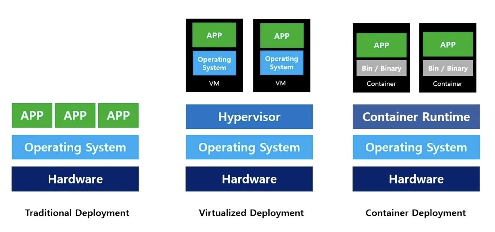

## 컨테이너와 오케스트레이션 툴, 쿠버네티스 이해하기

## Contents
- 쿠버네티스 서비스란?
- 쿠버네티스 서비스를 네이버클라우드플랫폼에서 운영한다면?
- 네이버클라우드플랫폼 쿠버네티스 서비스 생성해보기

### 쿠버네티스란?
- 쿠버네티스는 컨테이너화된 워크로드와 서비스를 관리하기 위한 이식성이 있고, 확장가능한 오픈소스 플랫폼
    

- Traditional Deployment
    - 기존에는 하드웨어 위에 OS에 있고, 그 위에 앱을 띄워서 사용

- Virtualized Deployment
    - Hypervisor인 가상화 엔진을 띄우고, 그 위에 여러 대의 VM을 띄우는 형태
    - VM에는 각각의 OS가 필요
    
- Container Deployment
    - VM과 다른 점은, VM은 가상화 엔진인 Hypervisor가 올라가지만, 컨테이너 환경에서는 Contianer Runtime 이라는 컨테이너 엔진과 같은 역할을 하는 것이 있고 그 위에 컨테이너들이 있음.
    - 그리고 각각의 컨테이너들은 OS를 필요로 하지 않음. 
    - 각각의 컨테이너들은 구동되고 있는 호스트의 OS 커널을 공유하는 구조로 동작하기 때문에 컨테이너들은 OS를 필요로 하지 않음
    - 쿠버네티스는 컨테이너로된 워크노드와 관련된 서비스를 관리하기 위한 오픈소스 플랫폼

### 쿠버네티스 기능
쿠버네티스는 분산 시스템을 탄력적으로 실행하기 위한 프레임 워크를 제공한다. 애플리케이션의 확장과 장애 조치를 처리하고, 배포 패턴 등을 제공

- **Automatic Binpacking**
    - Worker node의 가용성을 유지하면서 보유한 리소스를 충분히 활용할 수 있도록 스스로 스케줄링하며 컨테이너를 배치함

- **Storage Orchestration**
    - 로컬 저장소를 선택하거나 NFS, iSCSI 등과 같은 공유 네트워크 스토리지를 컨테이너에 할당/마운트 하여 사용 가능함

- **Secret & Configuration Management**
    - Application 연동 및 접근 제어를 위한 보안 키, 설정 내역을 컨테이너 이미지의 변경 없이 업데이트 할 수 있고 외부로 노출하지 않고 사용 가능함

- **Horizontal Scaling**
    - CPU 사용률과 같은 metric을 기반으로 pod의 Deployments, replicaset을 스케줄링하여 수평적 확장 가능함

- **Service Discovery & Load Balancing**
    - 컨테이너에 IP주소를 자동으로 할당하고 클러스터 내 트래픽을 로드 밸런싱 할 수 있는 컨테이너 세트에 단일 DNS 이름을 할당함

- **Self Healing**
    - 실패한 컨테이너를 자동으로 다시 시작하고, 사용자가 정의한 헬스 체크에 응답이 없는 컨테이너를 종료함. 
    - 워커 노드 장애 시 사용 가능한 다른 워커 노드에 컨테이너를 다시 기동함

- **Batch Execution**
    - 컨테이너 기반의 서비스 관리 뿐 아니라 배치 및 CI 작업 부하를 관리할 수 있으므로 원하는 경우 실패한 컨테이너 대체 가능함

- **Automatic Rollbacks & Rollouts**
    - 컨테이너의 응용 프로그램이나 구성에 대한 변경 사항을 점진적으로 업데이터 하고 문제 발생 시 자동으로 롤백 할 수 있음

### Kubernetes Components

#### Master Node
마스터 노드는 워커 노드와 클러스터 내 파드를 관리

- **Kubernetes Master**
    - Kubernetes Cluster에서 컨테이너의 관리 및 배포를 관리하는 액세시 제어 플레인
    - 클러스터 복제 페턴에 따라 마스터 수는 1개 이상임

- **API Server**
    - Kubernetes API를 노출하는 컴포넌트로, Kubernetes 오브젝트 관리/제어를 위한 프론트엔드

- **Scheduler**
    - Node가 배정되지 않은 새로 생성된 Pods를 감지하고 그것이 구동될 Node를 선택함

- **Controller-Manager**
    - 4개의 컨트롤러는 논리적으로는 개별 프로세스이지만 복잡성을 낮추기 위해 단일 바이너리로 컴파일
    - Node Controller : 노드가 다운되었을 때 통지와 대응
    - Replication Controller : 모든 replicatin controller object에 대해 알맞는 수의 pods를 유지
    - Endpoint Controller : 서비스와 Pods를 연결
    - Service Controller : 새로운 네임스페이스에 대한 기본 계정과 API 접근 토큰 생성

- **Etcd**
    - 모든 클러스터 데이터를 담는 key-value 저장소
    - Replicaset, controller, scheduler, kubelet 등은 etcd에 바로 접근하지 않고 API Server를 통해 etcd 데이터에 접근할 수 있음